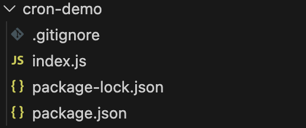

---
# Frontmatter section
title: DevLog 1-3 
description: DevLog 1-3
---
import { Code } from '@astrojs/starlight/components';
import GreetingCode from '../../../assets/devlog-1-3/greeting.js?raw'
import ServerScript from '../../../assets/devlog-1-3/script.json?raw'
import { Steps } from '@astrojs/starlight/components';

# Pacis Nkubito: DEVLOG 1-3

## Node.js and Cron Jobs

This week I learned how to setup a Node.js environment and setup a simple project.

First, I installed the latest version of Node.js (v25.4.0) from the official website. After installation, I verified the installation by running `node -v` and `npm -v` in the terminal.

Next, I run a simple script to test my Node.js environment:

<Code code={GreetingCode} lang="js" title={"Simple JavaScript Script"} />

Then I run the script using the command `node script.js`, and it printed "Hello, from Node" in the terminal.

Then I learned about NPM which is Node Package Manager in full. This is a tool that helps manage libraries for Node.js projects. I initialized my project using `npm init -y`, which created a `package.json` file.



Then I learned about nodemon, which is basically a tool that helps to automatically restart the application when file changes are detected. I installed it using `npm install nodemon --save-dev`.

Then I learned how we can make node.js development easier by using scripts inside package.json. This is handy especially when you have multiple commands or parameters to run. 

<Code code={ServerScript} lang="json" title={"Server Scripts"} />

With this I can start our project using `npm start`.

Then I learned about cron jobs and how to schedule them. In node.js we can use a package called `node-cron`. I installed it using `npm install node-cron`.

With this we can create a task to run every 10 minutes using the cron expression `0 */10 * * * *`.

```javascript title ="Cron Jobs in Javascript"
var job = new CronJob(
	'0 */10 * * * *',
	function() {
		console.log('The local time is: '+ new Date().toLocaleString());
	},
	null, true, 'America/New_York'
);
```

This task will print the local time every 10 minutes.

Finally, I published my code on Github and the repository can be found [here](https://github.com/N-Pacis/cron-demo).

