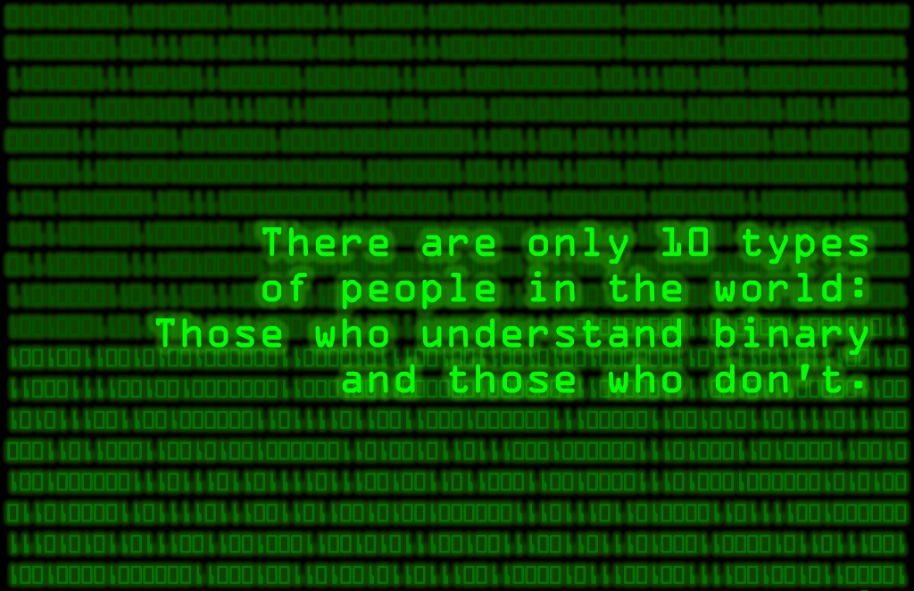

---
# Frontmatter section
title: DevLog 2-1
description: DevLog 2-1
---

# Pacis Nkubito: DEVLOG 2-1

## Astro Starlight

[Github Repo](https://github.com/N-Pacis/dig345-devlog)

import { Steps, Code, Tabs } from '@astrojs/starlight/components';

This week I learned how to customize an Astro.js Starlight project and deploy it using Github Actions.

### Steps Component

<Steps>
1. We can use the steps component to create a step-by-step guide.

2. Steps is an ordered list that can contain any valid markdown content.

3. To use the Steps component, you need to import it from `@astrojs/starlight/components`.
</Steps>

### Code Component
I also learned how to use the Code component to display code snippets. This is particularly useful when you want to document some code examples but you don't want to duplicate the code in your markdown file as the code can change.

To use the Code component, you need to import it from `@astrojs/starlight/components` and then use it like this:
<Code code={`console.log('Hello, World!');`} lang="js" title={"Hello World in JavaScript"} />

You can also use an imported code file like this:
```jsx
import ExampleCode from './example.js?raw'
<Code code={ExampleCode} lang="js" title={"Example Code from File"} />
```

### Tabs Component
I also learned how to use the Tabs component. This component can be useful when you want to display a code snippet in multiple languages. 

To use this component, you import it from `@astrojs/starlight/components` and then use it like this:

```jsx
<Tabs>
  <Tabs.Tab label="JavaScript">
    <Code code={`console.log('Hello, World!');`} lang="js" title={"Hello World in JavaScript"} />
  </Tabs.Tab>
  <Tabs.Tab label="Python">
    <Code code={`print('Hello, World!')`} lang="python" title={"Hello World in Python"} />
  </Tabs.Tab>
```

### Github Actions

Finally, I learned how to deploy my project to Github Pages using Github Actions. To start , you create workflow file in the `.github/workflows` directory of your repository. Then once you push your code, the website will be deployed at `https://<your-github-username>.github.io/<your-repo-name>/`.

### Reflection
This week I learned how Astro.js and Starlight can come in handy when writing a technical documentation for a library or a project. There is a lot of ready-to-go components that can help in making these documentations.

### Heydon Pickering Why is everything binary?. 
Heydon Pickering's video explains why computers use the binary system and how everything in the world often revolves around two states yet some of the time it's not entirely true. I loved the concept of how we take designers and developers as two different departments yet in reality they are two sides of the same coin.

One of the quote I remember is that "An x-bit computer means that it can process x bits of data at a time. For example, a 8-bit computer can process 8 bits of data at a time."

But I have a question: Do modern supercomputers or GPUs use binary system as well? If so how many bits do they process at a time?

Finally, the image below shows how in the world most things can be represented as two states. For example, there exists 10 types of people, (10 in binary is 2), those who understand binary and those who don't.


