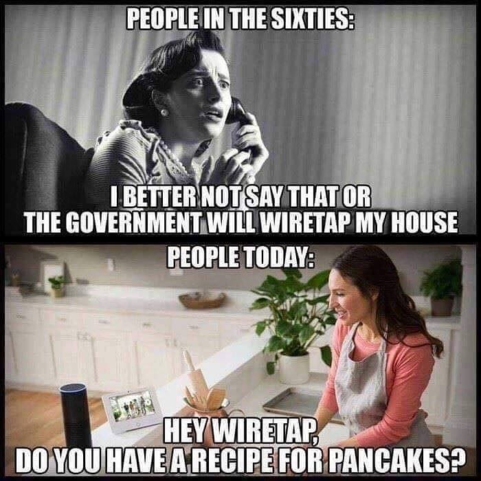

import { Steps } from '@astrojs/starlight/components';

# Pacis Nkubito: DEVLOG 4-3

## Database-driven application with Node/Express/MongoDB

This week I learned how to build a full-stack application using HTML, CSS, and JavaScript on the frontend with Node.js, Express, and MongoDB on the backend. I also used MongoDB Atlas to host my database in the cloud.

## Building the Big Feelings Backend

<Steps>

1. **Fork the [criticalwebdesign/big-feelings-starter](https://github.com/criticalwebdesign/big-feelings-starter) and update it per Module 10.3.**
   
   I forked the  repo and installed the dependencies with `npm install`.

2. **Modify the project structure, install dependencies, and run the project.**
   
   I organized my project with an `api` folder for backend code and `assets` for frontend files. The main files I worked with were `index.js` for the Express server and `routes.js` for API endpoints.

3. **Create a MongoDB Database (CWD 10.4)**
   
   I created a free database on MongoDB Atlas and set my network address to `0.0.0.0/0` to allow connections from anywhere. 

4. **Create an .ENV file, add your connection credentials, and test your database connection (CWD 10.4)**
   
   I created an `.env` file to store my mongodb connection string:

   ```bash
   MONGODB_URI=my_mongodb_connection_string
   ```

5. **Add routes to get data from MongoDB (CWD 10.4)**
   
   I added a route to fetch all feelings from the database:

   ```javascript
    router.get("/api/feelings", async function (req,res){
        let result = await db.getAll();
        res.json(result);
    })
   ```
6. **Allow Visitors to Submit Feelings (CWD 10.4)**

   I created a form handler that lets visitors submit their feelings:

   ```javascript
    function submitForm(e) {
        try {
            // 👉 add code inside this function (Chapter 10 wiki) ...
            e.preventDefault();
            let data = getFormData();
            console.log(data);
            data.lat = Number(data.lat);
            data.lng = Number(data.lng);
            let options = {
                method: "POST",
                headers: {
                    "Content-Type": "application/json",
                },
                body: JSON.stringify(data),
            };

            fetch(baseurl + "/api/feeling", options)
                .then((response) => response.json())
                .then(async (json) => {
                    updateMap(json);
                    showSuccessMsg("Your feeling was added");
                    let form = document.querySelector(".popupInput");
                    if (form) form.style.display = "none";
                });

            // 👈
        } catch (e) {
            showSuccessMsg("Please add a feeling and select a location", "white");
        }
    }
   ```

8. **Add an environment variable and deploy your project on Vercel. (CWD 10.4)**
   
   I added my MongoDB URI to Vercel's environment variables and deployed the project at: https://pacis-big-feelings.vercel.app/.

</Steps>

## Reading Response

### ICE Is Going on a Surveillance Shopping Spree, EFF 2026

I found it pretty disturbing how ICE is buying up surveillance tech from a lot of companies like Magnet Forensics and Pen Link to track people without warrants nor the rights to do so. Also this article shows how our personal data from the apps we use everyday gets sold and used for immigration enforcement without our knowledge. 

I also learned that "taking public transit or bicycling is a great way to keep yourself off ALPR databases, but an even better way is to go to your local city council meetings and demand the city cancels contracts with ALPR companies".

One question I have is, as tech enthusiasts, how can we build tools that people can use to protect their digital privacy even with all these anti-privacy technologies?

Finally, the meme below shows how even the devices we trust the most at home can be used to spy on us or as surveillance tool for the government.


## Reflection

Building this project taught me how backend and frontend connect through APIs and how the backend communicates with a mongodb database. It was awesome seeing how a user can submit a feeling from any point on the world map and the database stores that data and when they come back it will just be displayed.
