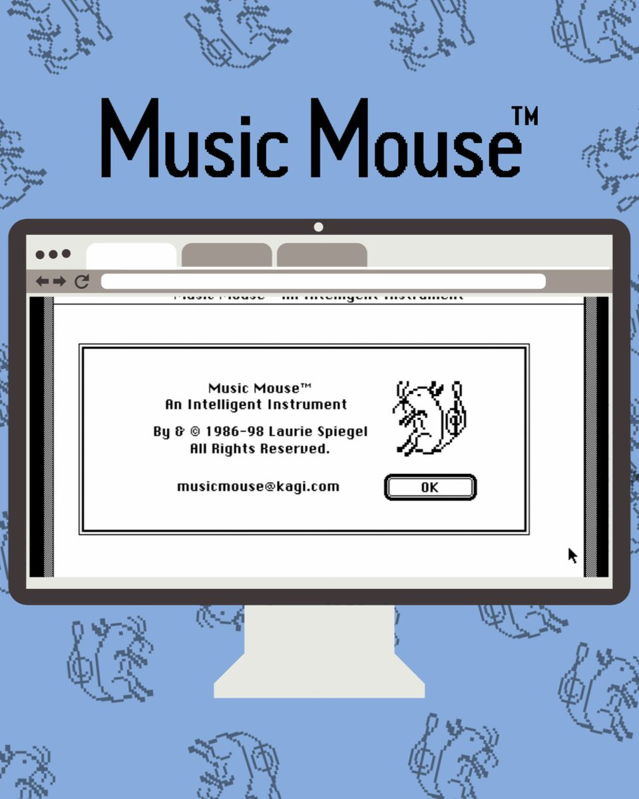

import { Steps } from '@astrojs/starlight/components';

# Pacis Nkubito: DEVLOG 5-3

## Interactive Sound Experience with Strudel and Tone.js

This week I learned how to add sound to my project using Tone.js. I learned how to manipulate web audio API using Strudel and Tone.js. I also completed the Strudel tutorials and built a Guitar using Tone.js.

## Building an Interactive Audio Experience

<Steps>

1. **Complete the Strudel First Sounds tutorial. Post a link to your finished REPL ✏️ here.**

    [First Sounds](https://strudel.cc/#Ly9QYWNpcyBOa3ViaXRvCgovL1NPVU5EUwpzb3VuZCgibWV0YWwiKQpzb3VuZCgiY2FzaW8iKQpzb3VuZCgiaW5zZWN0IikKc291bmQoIndpbmQiKQpzb3VuZCgiamF6eiIpCnNvdW5kKCJtZXRhbCIpCnNvdW5kKCJjcm93IikKCnNvdW5kKCJjYXNpbzoxIikKCi8vRFJVTVMKLy9DaG9vc2UgZHJ1bSB0eXBlCnNvdW5kKCJiZCBoaCBzZCBvaCBsdCBtdCBodCByZCIpLmJhbmsoIlJoeXRobUFjZSIpCgovL1NFUVVFTkNFUwpzb3VuZCgiYmQgaGggc2QgaGgiKQovL0N5Y2xlIGlzIDJzIGxvbmcuIHRoZSBsb25nZXIgdGhlIHNlcXVlbmNlIHRoZSBmYXN0ZXIgaXQgcnVucwovL1lvdSBjYW4gY2hvb3NlIHRvIHJ1biBldmVyeSBub3RlIHRoZSB3aG9sZSBjeWNsZSBieSA8Pgpzb3VuZCgiPGJkIGJkIGhoIGJkIHJpbSBiZCBoaCBiZD4iKQovL3NwZWVkIGl0IHVwIC0gIG1ha2UgaXQgOCB0aW1lcyBmYXN0ZXIKc291bmQoIjxiZCBiZCBoaCBiZCByaW0gYmQgaGggYmQ%2BKjgiKQoKLy9TZXQgdGVtcG8gLSBjcG0oY3ljbGVzIHBlciBtaW51dGUpCnNldGNwbSg5MC80KQpzb3VuZCgiPGJkIGhoIHJpbSBoaD4qOCIpCgovL2FkZGluZyByZXN0cwpzb3VuZCgiYmQgaGggLSByaW0gLSBiZCBoaCByaW0iKQoKLy9hZGRpbmcgc3ViLXNlcXVlbmNlcwpzb3VuZCgiYmQgW2hoIGhoXSBzZCBbaGggYmRdIGJkIC0gW2hoIHNkXSBjcCIpCi8vc3BlZWQgdXAgc3Vic2VxdWVuY2VzCnNvdW5kKCJiZCBbaGggcmltXSoyIGJkIFtoaCByaW1dKjEuNSIpCgovL3BsYXkgc2VxdWVuY2VzIGluIHBhcmFsbGVsIC0gdXNpbmcgY29tbWFzCnNvdW5kKCJoaCBoaCBoaCwgYmQgY2FzaW8iKQoKLy9tdWx0aXBsZSBsaW5lcwpzb3VuZChgYmQqMiwgLSBjcCwgCi0gLSAtIG9oLCBoaCo0LApbLSBjYXNpb10qMmApCgovL2Jhc2ljIHJvY2sgYmVhdApzZXRjcG0oMTAwLzQpCnNvdW5kKCJbYmQgc2RdKjIsIGhoKjgiKS5iYW5rKCJSb2xhbmRUUjUwNSIpCgovL3llbGxvdyBNYWdpYyBPcmNoZXN0cmEgLSBGaXJlY3JhY2tlcgpzZXRjcG0oMTIwLzIpCnNvdW5kKCJiZCBzZCwgLSAtIC0gaGggLSBoaCAtIC0sIC0gcGVyYyAtIHBlcmM6MSoyIikKLmJhbmsoIlJvbGFuZENvbXB1cmh5dGhtMTAwMCIpCg%3D%3D)

2. **Complete the Strudel First Notes tutorial. Post a link to your finished REPL ✏️ here.**
    [First Notes](https://strudel.cc/#Ly9waWFubyB3aXRoIG51bWJlcnMKbm90ZSgiNDggNTIgNTUgNTkiKS5zb3VuZCgicGlhbm8iKQoKLy9waWFubyB3aXRoIGxldHRlcnMKbm90ZSgiYyBlIGcgYiIpLnNvdW5kKCJwaWFubyIpCgovL2FkZGluZyBmbGF0cwpub3RlKCJkYiBlYiBnYiBhYiBiYiIpLnNvdW5kKCJwaWFubyIpCm5vdGUoImMjIGQjIGYjIGcjIGEjIikuc291bmQoInBpYW5vIikKCi8vcGxheWluZyBsZXR0ZXJzIGluIGRpZmZlcmVudCBvY3RhdmVzCm5vdGUoImMyIGUzIGc0IGI1Iikuc291bmQoInBpYW5vIikKCi8vY2hhbmdpbmcgdGhlIHNvdW5kcwpub3RlKCIzNiA0MywgNTIgNTkgNjIgNjQiKS5zb3VuZCgicGlhbm8iKQoKLy9zd2l0Y2ggYmV0d2VlbiBzb3VuZApub3RlKCI0OCA2NyA2MyBbNjIsIDU4XSIpCi5zb3VuZCgicGlhbm8gZ21fZWxlY3RyaWNfZ3VpdGFyX211dGVkIikKCi8vc3RhY2sgbXVsdGlwbGUgc291bmQKbm90ZSgiNDggNjcgNjMgWzYyLCA1OF0iKQouc291bmQoInBpYW5vLCBnbV9lbGVjdHJpY19ndWl0YXJfbXV0ZWQiKQoKLy9wbGF5IG9uZSBzZXF1ZW5jZSBwZXIgY3ljbGUKbm90ZSgiPFszNiA0OF0qNCBbMzQgNDZdKjQgWzQxIDUzXSo0IFszOSA1MV0qND4iKQouc291bmQoImdtX2Fjb3VzdGljX2Jhc3MiKQoKLy9hZGRpbmcgc2NhbGVzCnNldGNwbSg2MCkKbigiMCAyIDQgPFs2LDhdIFs3LDldPiIpCi5zY2FsZSgiQzptaW5vciIpLnNvdW5kKCJwaWFubyIpCgovL2Vsb25nYXRlIHdpdGggc3Vic2VxdWVuY2VzCnNldGNwbSg2MCkKbigiPFs0QDIgNF0gWzVAMiA1XSBbNkAyIDZdIFs1QDIgNV0%2BKjIiKQouc2NhbGUoIjxDMjptaXhvbHlkaWFuIEYyOm1peG9seWRpYW4%2BLzQiKQouc291bmQoImdtX2Fjb3VzdGljX2Jhc3MiKQoKLy9wbGF5IG11bHRpcGxlIHBhdHRlcm5zCiQ6IG5vdGUoIjxbYzIgYzNdKjQgW2JiMSBiYjJdKjQgW2YyIGYzXSo0IFtlYjIgZWIzXSo0PiIpCi5zb3VuZCgiZ21fc3ludGhfYmFzc18xIikubHBmKDgwMCkKCiQ6IG4oYDwKW34gMF0gMiBbMCAyXSBbfiAyXQpbfiAwXSAxIFswIDFdIFt%2BIDFdClt%2BIDBdIDMgWzAgM10gW34gM10KW34gMF0gMiBbMCAyXSBbfiAyXQo%2BKjRgKS5zY2FsZSgiQzQ6bWlub3IiKQouc291bmQoImdtX3N5bnRoX3N0cmluZ3NfMSIpCgokOiBzb3VuZCgiYmQqNCwgW34gPHNkIGNwPl0qMiwgW34gaGhdKjQiKQouYmFuaygiUm9sYW5kVFI5MDkiKQ%3D%3D)

3. **Complete the Strudel First Effects tutorial. Post a link to your finished REPL ✏️ here.**
    [First Effects](https://strudel.cc/#Ly9sb3cgcGFzcyBmaWx0ZXIKbm90ZSgiPFtjMiBjM10qNCBbYmIxIGJiMl0qNCBbZjIgZjNdKjQgW2ViMiBlYjNdKjQ%2BIikKLnNvdW5kKCJzYXd0b290aCIpLmxwZig4MDApCgovL3Zvd2VsCm5vdGUoIjxbYzMsZzMsZTRdIFtiYjIsZjMsZDRdIFthMixmMyxjNF0gW2JiMixnMyxlYjRdPiIpCi5zb3VuZCgic2F3dG9vdGgiKS52b3dlbCgiPGEgZSBpIG8%2BIikKCi8vY29tYmluYXRpb24KLy8gJDogc291bmQoImhoKjgiKS5nYWluKCJbLjI1IDFdKjQiKQoKLy8gJDogc291bmQoImJkKjQsW34gc2Q6MV0qMiIpCgovLyAkOiBub3RlKCI8W2MyIGMzXSo0IFtiYjEgYmIyXSo0IFtmMiBmM10qNCBbZWIyIGViM10qND4iKQovLyAuc291bmQoInNhd3Rvb3RoIikubHBmKCIyMDAgMTAwMCAyMDAgMTAwMCIpCgovLyAkOiBub3RlKCI8W2MzLGczLGU0XSBbYmIyLGYzLGQ0XSBbYTIsZjMsYzRdIFtiYjIsZzMsZWI0XT4iKQovLyAuc291bmQoInNhd3Rvb3RoIikudm93ZWwoIjxhIGUgaSBvPiIpCgovL3JldmVyYgpuKCI8NCBbM0AzIDRdIFs8MiAwPiB%2BQDE2XSB%2BPiIpCi5zY2FsZSgiRDQ6bWlub3IiKS5zb3VuZCgiZ21fYWNjb3JkaW9uOjIiKQoucm9vbSgyKQoKLy9wYW4Kc291bmQoIm51bWJlcnM6MSBudW1iZXJzOjIgbnVtYmVyczozIG51bWJlcnM6NCIpCi5wYW4oIjAgMC4zIC42IDEiKQ%3D%3D)

4. **Complete all five parts of the Getting Started with Tone.js | Web Audio Tutorial - Pts 1-5 (3:31, 6:37, 10:20, 5:59, 9:28). Post a link to your finished project online ✏️ here.**

    [Tone.js Tutorial Project](https://n-pacis.github.io/dig345-tone-js-project/)
    
</Steps>

**Design and code an "interactive audio experience" that makes use of Tone.js. Consider using shapes, color, and other visuals in addition to sounds. This need not be fancy or polished, since you have less than a week to complete it. Try to have fun creating.**
- Post design mockups (pencil/paper, Figma, etc.) here. ✏️
- Post links to your project, a video, and a 100-150 word statement about the concept and technology of your interactive audio experience ✏️ here.

To Learn more about sound in javascript, I created a simple 6 strings guitar using Tone.js, HTML, and CSS. First, I used my IPad to sketch out the visual elements of my digital guitar. I explored layouts, design, and color schemes and finalized a rough sketch of what I think could best represent my application.

Then, I used HTML and CSS to create the body and strings of the guitar. I mostly used div tags and styled them to look like guitar strings. I labeled each guitar string and gave it a data-key in a set of `Q-W-E-R-T-Y` and then created a style for a class called active that would be dynamically added and removed from the guitar strings and when added It would highlight the plucked string.

Finally, I used Tone.js to add sound to my guitar. I mapped each guitar string to a specific note as follows: `Q = E2, W = A2, E = D3, R = G3, T = B3, Y = E4`. Then I added an event listener that listens for keydown events and then checks if the pressed key is one of the guitar strings and if it is, it plays the corresponding note and highlights the string as follows:
    
```javascript
    function playGuitarNote(note, key) {
        if (Tone.context.state !== 'running') {
            Tone.context.resume();
        }

        const stringElement = document.querySelector(`.string[data-key="${key}"]`);
        
        if (stringElement) {
            stringElement.classList.add('active');
        }

        pluckSynth.triggerAttackRelease(note, "4n");

        setTimeout(() => {
            if (stringElement) {
                stringElement.classList.remove('active');
            }
        }, 400);
    }

    document.addEventListener('keydown', (event) => {
        const key = event.key.toLowerCase();
        if (noteMap[key]) {
            playGuitarNote(noteMap[key], key);
        }
    });
```

I then hosted my project on Github Pages and it can be previewed [here](https://n-pacis.github.io/dig345-interactive-audio-exprerience/)

Below is a video demonstration of the above project as well:

{/* <video controls width="100%" height="auto">
    <source src="../../../assets/devlog-5-3/video.mp4" type="video/mp4" />
    Your browser does not support the video tag.
</video> */}
    
## Reading Response
### Music Mouse Explained | Laurie Spiegel on Algorithmic Composition (1987 Archive) (27:38)

In this video, right of the bat, I was impressed by how Laurie Spiegel designed a macintosh program in 1987 using C programming. She explains how she used a macintosh and it's accessories like a music mouse and a keyboard to help people create music easily and faster by automatic pitch selection and hence support people's musicality without limiting it. It is a pretty impressive program that runs efficiently and produces good sound. 

The most memorable parts of the video for me where "Any instrument has aesthetic biases, all insturments do, all languages do, and this happens to fit some of my own personal definition of musicality." and "we live in a sort of elitist musical word in a way, people who don't have the theoretical background but who have the sensitivity and imagination generally haven't had a way of making music."

One question I have is, Is the same technology that Laurie Spiegel used still being used in modern music software today?

Finally, I couldn't find many memes about music softwares but I found this image that summarizes the software of Laurie Spiegel pretty well:

